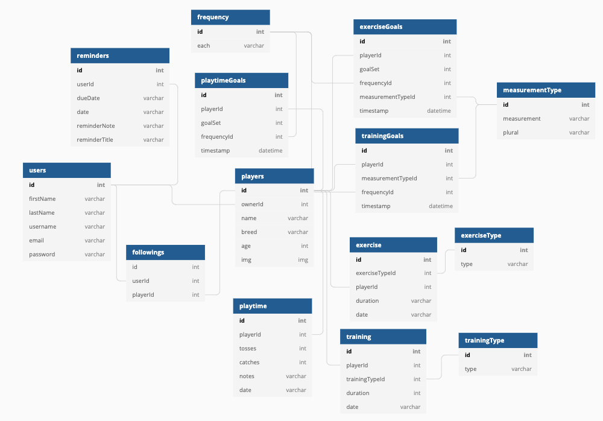

## Wide Retriever

<b style="font-size: 20px;"><i>The fitness tracker for your pup!</i></b>

### Application Overview

Wide Retriever is a health & fitness application for Dog Parents to keep track of how much exercise their dog is getting, how well their training is going, and measure their performance in games of 'catch'. Dog owners need to be aware of their pup’s health and fitness just as much as their own. This app motivates users to exercise their pups in a fun way, and allows users to set fitness goals and track their pup’s progress.

I built this application in two weeks initially, using React Hooks and CSS for styling. My goals were to incorporate full CRUD functionality with many-to-many relationships, gain a deeper understanding of React Hooks, props, and state, while also incorporating an intuitive, functional user interface, without the use of bootstrapped components.

### Features

<p>
• Users can set unique exercise, training, and playtime goals for each pup.<br>
• Users can record exercise, training, and playtime sessions for each pup.<br>• Users can track each pup's unique progress and make adjustments to the goals if necessary.<br>• Users can follow other pups and view their progress.
</p>

### Technologies Used

       

### Running This Application

#### First, a note about authentication...

This application uses mock authentication which is purely for demonstration purposes. Therefore the login and registration code written here is completely insecure and would never be implemented in a professional application.

#### Now that we've cleared that up...

1. Clone this repository and change to the directory in the terminal.

```sh
git clone git@github.com:heymonicakay/wideRetriever.git
cd wideRetriever
```
2. Access the data.

<a href="https://www.github.com/heymonicakay/wideRetriever-server" target="_blank"></a>

3. Launch the client.

```sh
    npm install
    npm start
```

#### Demo User Credentials

<p>
Username: <i>demo</i>
<br>
Password: <i>demo</i>
</p>

#### ERD




#### Created by Monica Kay

<a href="https://www.github.com/heymonicakay/" target="_blank"></a> <a href="https://www.linkedin.com/in/heymonicakay/" target="_blank"></a>
